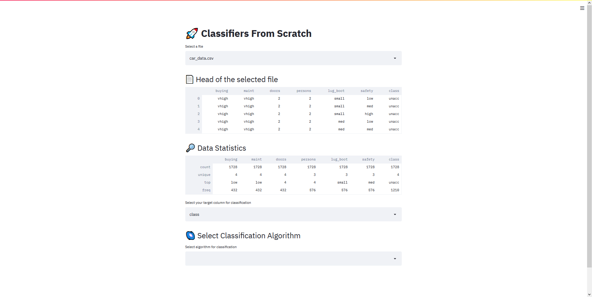
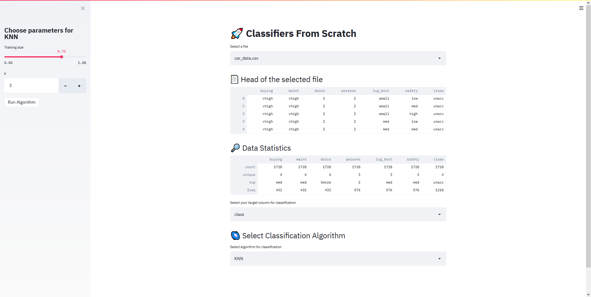
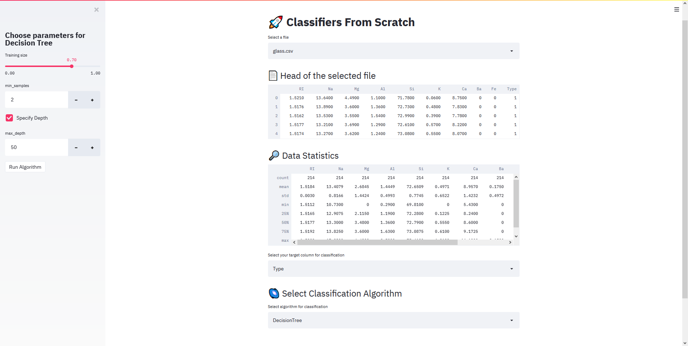
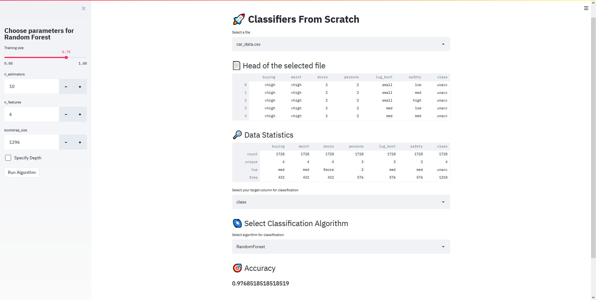

# :rocket: Classifiers From Scratch
Implementations of different classification algorithms from scratch

## :bookmark_tabs: Currently Implemented Algorithms
:heavy_check_mark: K-Nearest Neighbours  
:heavy_check_mark: Decision Tree  
:heavy_check_mark: Random Forest  

## :dart: Details About Algorithms
- All algorithms were written using only [Numpy](https://github.com/numpy/numpy) and [Pandas](https://github.com/pandas-dev/pandas) libraries

### K-Nearest Neighbours
In pattern recognition, the k-nearest neighbours algorithm (k-NN) is a non-parametric method proposed by Thomas Cover used for classification and regression. 
In both cases, the input consists of the k closest training examples in the feature space. The output depends on whether k-NN is used for classification or regression.
In k-NN classification, the output is a class membership. An object is classified by a plurality vote of its neighbours, with the object being assigned to the class most common among its k nearest neighbours.

### Decision Tree
Decision Tree models where the target variable can take a discrete set of values are called classification trees; in these tree structures, leaves represent class labels and branches represent conjunctions of features that lead to those class labels.

### Random Forest
Random Forests are an ensemble learning method for classification, regression and other tasks that operate by constructing a multitude of decision trees at training time and outputting the class that is the mode of the classes (classification) or mean/average prediction (regression) of the individual trees.

## Details About UI
- UI created by using [streamlit](https://github.com/streamlit/streamlit) library
- UI includes data preview, data statistics and classification parts
- You can start the app by using command below
```
    streamlit run app.py
```

### :shipit: Some Screenshots of UI
#### Main Screen

#### KNN

#### Decision Tree

#### Random Forest and Test

